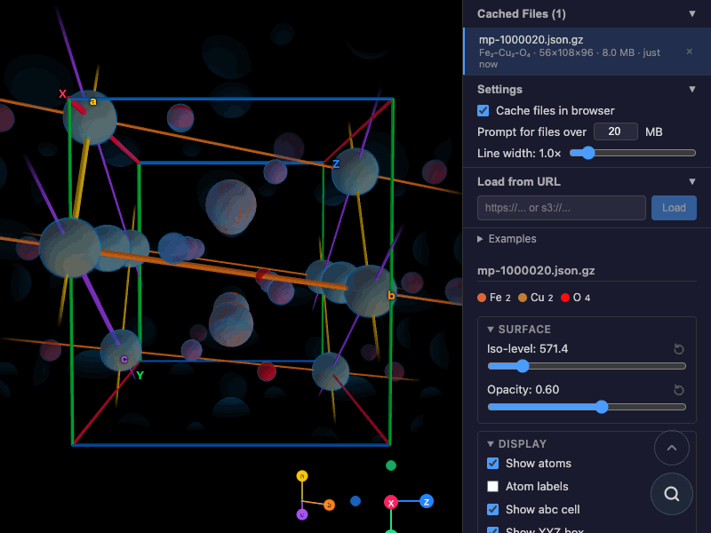

# ELvis – Electron Density Visualization

Interactive 3D electron density viewer for VASP CHGCAR/ELFCAR files and [Materials Project] data.

**[Try it live →][demo]**

<p align="center">
  <a href="https://elvis.rbw.sh/?m=mp-1000020&xb&xa&do">
    
  </a>
</p>

## Features

- **Drag-and-drop** CHGCAR, ELFCAR, and `.npy` files
- **Materials Project** integration: load `.json.gz` charge densities from the MP S3 bucket
- **Isosurface** rendering with adjustable iso-level and opacity
- **Crystal structure** overlay: atoms, abc lattice cell, XYZ bounding box, world axes
- **2D slice** viewer along any axis
- **Keyboard navigation**: orbit, pan, zoom, roll; snap to lattice or world axes
- **Discrete 90° orbit** mode for presentation-quality views
- **Comparison view**: load multiple files side-by-side
- **OPFS caching**: browser-local cache for large charge density files
- **Deep-linking**: full camera, iso-level, and material state in URL params
- **Screenshotting**: [`scrns`]-based automation for og:image and GIF recordings

## Quick start

```bash
cd elvis
pnpm install
pnpm dev        # → http://localhost:3150
```

Or load a Materials Project example directly: [`elvis.rbw.sh/?m=mp-1000020`][demo]

## URL parameters

| Param | Description | Example |
|-------|-------------|---------|
| `m` | Materials Project ID | `mp-1000020` |
| `iso` | Iso-level | `571.4` |
| `op` | Opacity | `0.6` |
| `c` | Camera: θ° φ° zoom roll° | `178.8 31.3 11.5` |
| `a` | Animation duration (seconds) | `2.0` |
| `lw` | Line width multiplier | `1.5` |
| `xb` | Show XYZ bounding box | (flag) |
| `xa` | Show XYZ axes | (flag) |
| `do` | Discrete 90° orbit | (flag) |
| `si` | Slice index | `48` |

## Screenshots

Automated via [`scrns`]:

```bash
pnpm scrns              # all screenshots + screencasts
pnpm scrns -i og-image  # just the og:image
```

## Stack

[React] · [Three.js] / [React Three Fiber] · [Vite] · [TypeScript] · [`use-kbd`] · [`use-prms`]

[Materials Project]: https://materialsproject.org
[demo]: https://elvis.rbw.sh/?m=mp-1000020&xb&xa
[`scrns`]: https://www.npmjs.com/package/scrns
[React]: https://react.dev
[Three.js]: https://threejs.org
[React Three Fiber]: https://r3f.docs.pmnd.rs
[Vite]: https://vite.dev
[TypeScript]: https://www.typescriptlang.org
[`use-kbd`]: https://www.npmjs.com/package/use-kbd
[`use-prms`]: https://www.npmjs.com/package/use-prms
